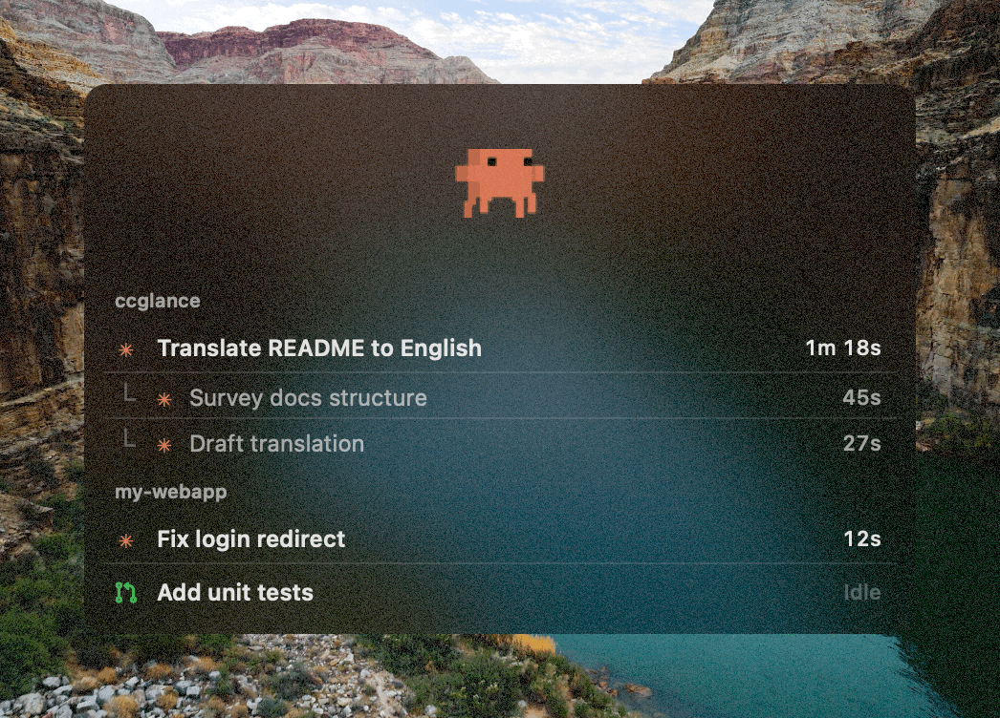

# ccglance

[](https://github.com/hatoya/ccglance/releases/latest)
[](https://github.com/hatoya/ccglance/releases)
[](LICENSE)
-black?logo=apple)
[](https://github.com/hatoya/ccglance/actions/workflows/release.yml)

A macOS app that shows Claude Code activity in an **always-on-top floating panel** instead of the menu bar. Park it in a corner of a secondary display and see at a glance which sessions are working, awaiting permission (yellow pulse), or finished.

It uses the same hooks mechanism as [claude-status-bar](https://github.com/m1ckc3s/claude-status-bar), but shows multiple sessions at once.



<a href="https://github.com/hatoya/ccglance/releases/latest/download/ccglance.zip"></a>

First install is just the button above: download, unzip, drag the app into Applications, launch once. See [Install](#install) for details.

## Install

**Homebrew** (Apple Silicon):

```bash
brew install --cask hatoya/tap/ccglance
```

**Manual download:**

1. [Download the latest `ccglance.zip`](https://github.com/hatoya/ccglance/releases/latest/download/ccglance.zip) and unzip it.
2. Drag **ccglance.app** into Applications.

Either way, launch the app once — on first launch it wires up the Claude Code hooks automatically (appends to `~/.claude/settings.json`; existing hooks are left untouched, and a backup is saved as `settings.json.bak-ccglance`). Then start a new Claude Code session — the panel appears and tracks it.

> **If Claude Code is already open, restart it (or start a new session) once.** Hooks are loaded when a session starts.

> Releases are Developer ID signed and notarized, so Gatekeeper runs them without any extra approval steps.

Requires an Apple Silicon Mac running macOS 12+, [Claude Code](https://claude.com/claude-code) (CLI or Desktop app), and Node.js (for the hooks script). Intel Macs are not supported by the prebuilt releases (build from source instead).

If the automatic hook setup doesn't work, run it manually:

```bash
node "/Applications/ccglance.app/Contents/Resources/install.js"
```

### Build from source

```bash
git clone https://github.com/hatoya/ccglance
cd ccglance
./build.sh
cp -R build/ccglance.app /Applications/
open /Applications/ccglance.app
```

Requires the Xcode Command Line Tools (`xcode-select --install`).

## Window behavior

- Always on top (even above full-screen apps)
- Visible on all Spaces / all monitors — leave it parked on a secondary display
- Drag to move it anywhere; the position is remembered
- Translucent HUD design that never steals focus (clicking it won't take focus away from the app you're working in)
- No Dock icon
- Right-click menu: quit / clear finished sessions / reinstall hooks / check for updates

## How it works

Claude Code lifecycle hooks (SessionStart / UserPromptSubmit / PreToolUse / PostToolUse / Notification / Stop / SessionEnd) write per-session state to `~/.claude/ccglance/sessions/<session_id>.json`. The app polls this directory every 0.5 seconds and renders the result.

- State files are deleted when a session ends
- Files not updated for 12 hours (crashed sessions) are cleaned up automatically
- The app is launched automatically on `SessionStart` (`open -g -a ccglance`)

### PR status on idle sessions

When a session goes idle, its row icon shows the pull-request state of the session's branch — open (green), draft (gray), merged (purple), or closed (red) — with a `PR #n` tooltip. The hook fetches this via the [gh CLI](https://cli.github.com) (`gh pr view`) in a detached child process on `Stop`/`SessionStart`, so nothing blocks Claude Code and the app itself never touches the network. If `gh` isn't installed or the branch has no PR, the plain idle dot is shown instead. While a session stays idle no hooks fire, so the state can go stale; use **Refresh session names** in the right-click menu to re-fetch it.

### Supported surfaces

| Surface | Supported |
| --- | --- |
| Claude Code CLI | ✅ |
| Claude Code Desktop (Code tab) | ✅ |
| Claude Desktop (Chat) / Cowork | ❌ (no hooks support) |

Permission detection relies on the CLI's permission notification. In the Desktop app, in-app prompts don't fire the hook, so the row keeps showing the tool name instead.

## Updates

The app checks GitHub Releases for the latest version 5 seconds after launch and every 24 hours (the launch check is skipped if the last check was less than 24 hours ago). When a newer version is found:

- An orange "⬆ Update to vX.Y.Z" banner appears at the bottom of the panel
- An "Update to ccglance vX.Y.Z…" item is added to the right-click menu

Clicking either one **updates in place**: it downloads the release zip → unpacks it → replaces the running `.app` → relaunches automatically. If the download or replacement fails, it rolls back and opens the release page in your browser (same for releases without a zip asset).

To check manually, use "Check for updates…" in the right-click menu.

Homebrew installs update the same way — the cask is marked `auto_updates`, so plain `brew upgrade` leaves the self-updating app alone (`brew upgrade --greedy` reinstalls it from the tap if you prefer managing updates through Homebrew).

### Updating manually

If you prefer not to use the in-app updater (or it can't run, e.g. the release has no zip asset):

1. [Download the latest `ccglance.zip`](https://github.com/hatoya/ccglance/releases/latest/download/ccglance.zip) and unzip it.
2. Drag **ccglance.app** into Applications — when Finder says an item with that name already exists, choose **Replace**. No need to uninstall first.
3. Launch it once. Hooks are refreshed automatically on every launch, so there is no manual migration step.

Release procedure (for maintainers):

1. Bump `VERSION` in `build.sh` and add the version's entry to `CHANGELOG.md` — list only what changed since the previous release
2. Push a `v<VERSION>` tag (`git tag v<VERSION> && git push origin v<VERSION>`). The [release workflow](.github/workflows/release.yml) builds the app on a macOS runner, creates a draft release with auto-generated notes (categorized by PR label via [`.github/release.yml`](.github/release.yml)), attaches `ccglance.zip` and `ccglance.zip.sha256`, and publishes it (both assets are required by the in-app updater; the workflow syncs the build version to the tag, so a missed bump still produces a correct zip)
3. Releases are immutable: assets cannot be added after publishing and a published tag can never be reused, so never publish a release by hand before the assets are attached — a broken release must be re-cut under a new version
4. The workflow then updates the [Homebrew tap](https://github.com/hatoya/homebrew-tap) cask to the new version (requires the `TAP_GITHUB_TOKEN` secret — see [docs/HOMEBREW.md](docs/HOMEBREW.md); skipped when unset)

`./build.sh` still works locally for development, and re-running the workflow via `workflow_dispatch` with the tag is the fallback if a tag push didn't produce a release. The zip name is unversioned so the `releases/latest/download/ccglance.zip` link always works. The repository to check can be changed via `UpdateChecker.repo` in `Sources/UpdateChecker.swift`.

## Uninstall

```bash
node "/Applications/ccglance.app/Contents/Resources/uninstall.js"
```

Then move the app to the Trash (or, for Homebrew installs, run `brew uninstall --cask ccglance` instead). Only ccglance's hooks are removed; any other hooks are left intact.

## Built with Claude / not affiliated

ccglance is an unofficial, open-source side project inspired by [claude-status-bar](https://github.com/m1ckc3s/claude-status-bar). It was built almost entirely with [Claude](https://claude.com) — from the Swift app and the hook scripts to this README and the demo GIF. It is not affiliated with, endorsed by, or sponsored by Anthropic. "Claude" is a trademark of Anthropic.

## License

MIT
